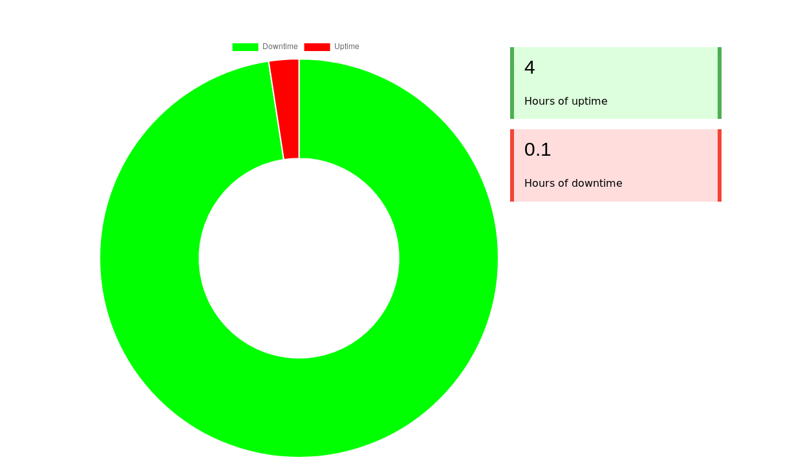
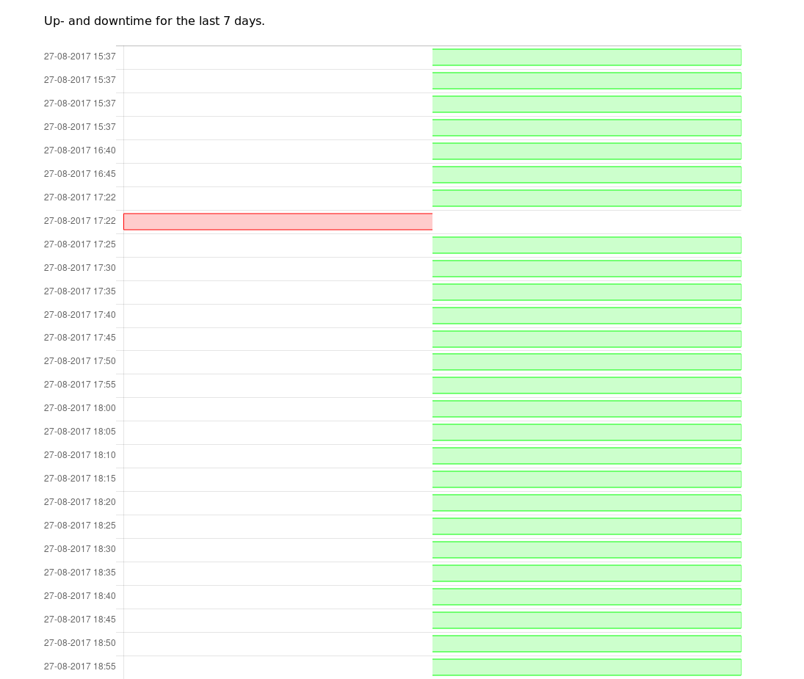

# Downtime Meter

Application to check when you don't have an internet connection.

I've created this application to prove to our ISP that everyday at
the same time our internet connection stops working since they wouldn't
believe us on our word...

## Screenshots




## Required packages

- php7
- php-mysqlnd

## Install

### .env file

Copy the `.env.example` file to `.env`

```
cp .env.example .env
```

Set the values in the `.env` file to your correct network / database values

### Dependencies

We can install the required dependencies with composer

```
$ composer install
```

### Database

First create the user and the database

```
mysql> CREATE USER downtimemeter;
mysql> CREATE DATABASE 'downtimemeter'@'localhost' IDENTIFIED BY 'secret';
mysql> GRANT ALL PRIVILEGES ON downtimemeter.* TO 'downtimemeter'@'localhost';
mysql> FLUSH PRIVILEGES;
mysql> quit;
```

* Please change the default password (`secret` in this case) to something a little more secure!

Now that the database has been created we can let the application create the tables.

```
$ php setup.php
```

### Cronjob

To make sure our application keeps checking for an active internet connection we
must specify a cronjob.

In most cases you don't want to ping too many times so we will set the interval to every
5 minutes in this example, you can however set the interval to any time you please in the cronjob.

```
# crontab -e
```

Inside the cronjob file put the following content

```
*/5 * * * * /path/to/the/application/ping.php
```

* Change `/path/to/the/application/` with the actual path to the downtime meter application. But leave
the `ping.php` at the end.

### Create required directory

Before we can open up a webpage we need to create a cache folder for blade (our templating engine).

```
mkdir app/cache
```